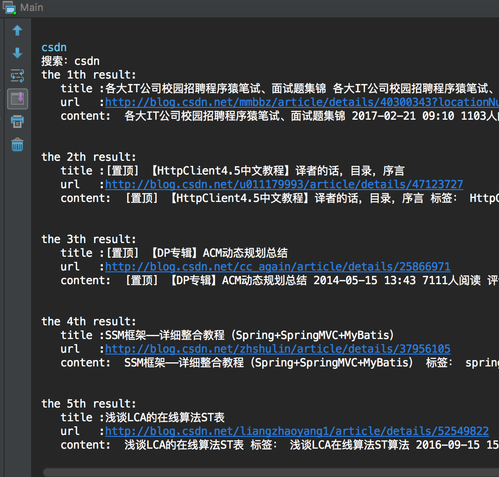

<<<<<<< HEAD
##lucene tutorial 
---
first commit 
only finished build index and search 

##finished
-[x] getUrls from webpage bookmarks (From xml file simply exported from chrome)
-[x] craw url content via webMagic ,due to time i only handled `blog.csdn.com` and `cnblogs.com` more will be added in the near future 

##TODO
-[ ] dumplicate remove unsolved
-[ ] merge with spring mvc
-[ ] loca file support

##sample

##libs used
- webmagic
- jsoup
- lucene
- spring mvc 
- junit
##TIPS
when building index finished filewriter must be close or it`ll throw no segement* exception 
while building loca indexing file a file named write.lock will be build ,and it`s not allowed to
read index file;
=======
##lucene tutorial 

---
first commit 
only finished build index and search 

##finished

-[x] getUrls from webpage bookmarks (From xml file simply exported from chrome)
-[x] craw url content via webMagic ,due to time i only handled `blog.csdn.com` and `cnblogs.com` more will be added in the near future 

##TODO

-[ ] dumplicate remove unsolved
-[ ] merge with spring mvc
-[ ] loca file support

##sample

##libs used

- webmagic
- jsoup
- lucene
- spring mvc 
- junit

##TIPS

when building index finished filewriter must be close or it`ll throw no segement* exception 
while building loca indexing file a file named write.lock will be build ,and it`s not allowed to
read index file;
>>>>>>> 26611a426a449901f0fbc41a7e26bb05b95972d5
